

# [Community Network Interactive Planner](http://18.220.148.72/cnip)

A Cloud Based Radio Network Planning And Design Tool

Distributed Architecture, Easy to use UI, Advanced Software Algorithm using Machine Learning

## Key Features

### Pre-loaded with several Open Source datasets
- **Global 30m** and **90m** [U.S. Geological Survey](https://usgs.gov) [SRTM](https://en.wikipedia.org/wiki/Shuttle_Radar_Topography_Mission) data 
- **Tile Maps**: [OpenStreetMap](https://openstreetmap.org), [OpenTopoMap](https://opentopomap.org), [stamen](http://maps.stamen.com) (Toner, Terrain & Watercolor layers) and [Thunderforest](https://thunderforest.com) (Transport, Cycle, Landscape & Outdoor layers)
- Adding more soon

### Data Sources
- [Global 30m SRTM](https://e4ftl01.cr.usgs.gov/MEASURES/SRTMGL1.003/2000.02.11/)
- [Global 90m SRTM](https://e4ftl01.cr.usgs.gov/MEASURES/SRTMGL3.003/2000.02.11/)
- [OpenStreetMap](https://openstreetmap.org)
- [OpenTopoMap](https://opentopomap.org)
- [stamen](http://maps.stamen.com)
- [Thunderforest](https://thunderforest.com)
 
### Infrastructure
- [AWS Cloud](https://aws.amazon.com/what-is-aws/) with Distributed Architecture

### Software Algorithm
- [k-means clustering ML](https://en.wikipedia.org/wiki/K-means_clustering) (Automatic Site Planning)
- [Kruskal Minimum Spanning Tree](https://en.wikipedia.org/wiki/Kruskal%27s_algorithm) (Shortest Path Links)
- [Delaunay triangulation](https://en.wikipedia.org/wiki/Delaunay_triangulation) (To Detect Neighboring Interferers)

### Technologies Supported
- Radio Access: **2G**, **4G** and 5GNR (coming soon)
- Backhaul: **PTMP**, **PTP** and Fiber Planning (coming soon)

### UI Features
- RF predictions for **Path Loss**, **Field Strength** and **Received Power** using [SPLAT](https://www.qsl.net/kd2bd/splat.html)
- Propagation models **Longley-Rice Irregular Terrain (ITM)** and **Irregular Terrain With Obstructions (ITWOM v3.0)** for spectrum  between **20 MHz** and **20 GHz**
- **Predict Sites** analysis for automatic site placement to cover the given polygon area using [k-means clustering ML](https://en.wikipedia.org/wiki/K-means_clustering)
- Automatic **Antenna Height** prediction by elevating site antenna above average terrain and clutter heights within the cell radius to meet line of sight
- **Best Candidate** analysis to find best site from coverage perspective for given polygon area from specified candidates  based on **Received Power** by analyzing polygon area covered by each power level distribution for each candidate
- Automatic **LTE PCI, GSM Frequency and BSIC** planning by computing interference cost matrix based on sites distance and using [Delaunay triangulation](https://en.wikipedia.org/wiki/Delaunay_triangulation) to detect neighboring interferers
- Automatic shortest path **Microwave Links** planning using [Kruskal Minimum Spanning Tree](https://en.wikipedia.org/wiki/Kruskal%27s_algorithm)
- Automatic **LOS Height** prediction for desired [Fresnel Zone](https://en.wikipedia.org/wiki/Fresnel_zone) clearance for Microwave Links
- **Path Profile** analysis for Microwave Links based on [SRTM](https://en.wikipedia.org/wiki/Shuttle_Radar_Topography_Mission) [DTM](https://en.wikipedia.org/wiki/Digital_elevation_model) data

### Reports
- Charts, Tables, Exports (PNG, CSV, GeoJSON, KML)

## User Guide

#### Adding New Site

Click below picture to watch video
[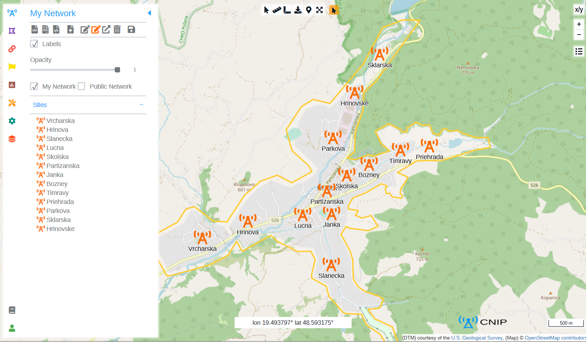](https://youtu.be/uEBEfSif5oI)

#### Adding Microwave Link

- **Microwave Links** spectrum between 1 GHz and 15 GHz supported
- **Channelwidth** between 10 MHz and 100 MHz supported

Click below picture to watch video
[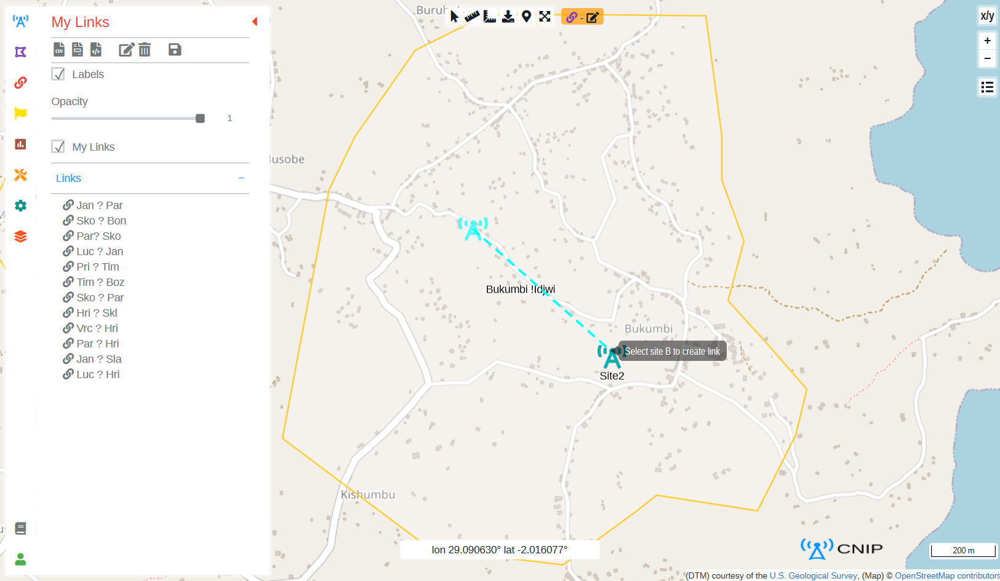](https://youtu.be/2MWgKqFmmio)

#### Creating And Editing Polygons

Click below picture to watch video
[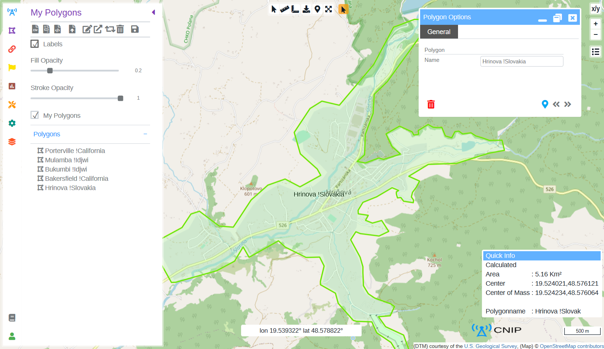](https://youtu.be/AZG8Xg8J57U)

#### Predicting Coverage

- Coverage predictions for **Path Loss**, **Field Strength** and **Received Power** using [SPLAT](https://www.qsl.net/kd2bd/splat.html)
- Propagation models **Longley-Rice Irregular Terrain (ITM)** and **Irregular Terrain With Obstructions (ITWOM v3.0)** for spectrum  between **20 MHz** and **20 GHz** supported

Click below picture to watch video
[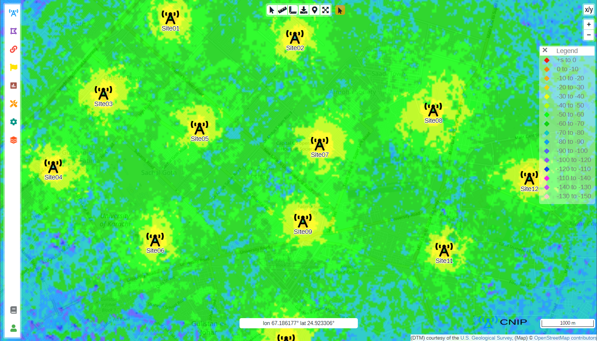](https://youtu.be/vUNtD-GlT4U)

#### Predicting Radio Plan

- Automatic **LTE PCI, GSM Frequency and BSIC** planning by computing interference cost matrix based on sites distance and using [Delaunay triangulation](https://en.wikipedia.org/wiki/Delaunay_triangulation) to detect neighboring interferers
- **GSM 900 PGSM** and **LTE B08 FDD 900 EGSM** bands supported

Click below picture to watch video
[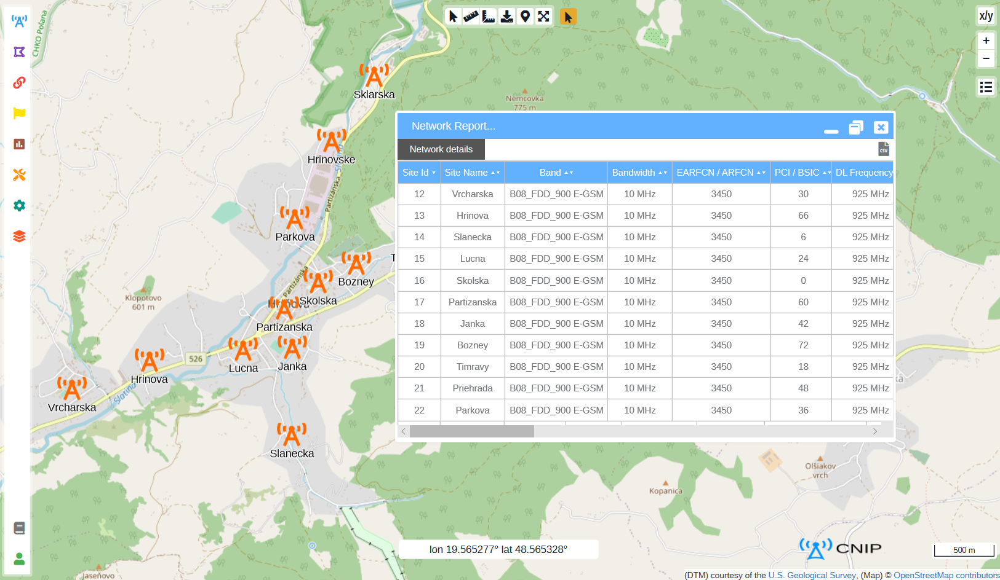](https://youtu.be/1lsnoXpvjik)

#### Predicting Microwave Links

- Automatic shortest path **Microwave Links** planning using [Kruskal Minimum Spanning Tree](https://en.wikipedia.org/wiki/Kruskal%27s_algorithm)
- Automatic **LOS Height** prediction for desired [Fresnel Zone](https://en.wikipedia.org/wiki/Fresnel_zone) clearance for Microwave Links

Click below picture to watch video
[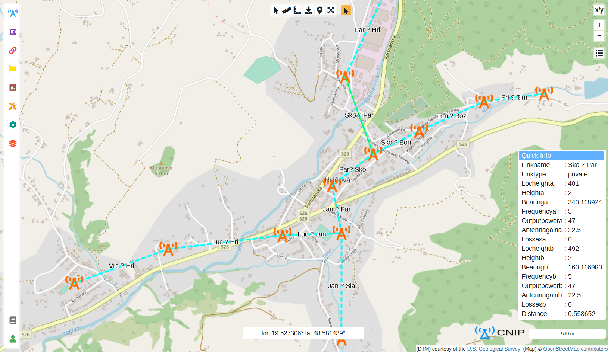](https://youtu.be/j1lr8WcP5js)

#### Microwave Link Path Profile

- **Path Profile** created using 30m [SRTM](https://en.wikipedia.org/wiki/Shuttle_Radar_Topography_Mission) [DTM](https://en.wikipedia.org/wiki/Digital_elevation_model) data

Click below picture to watch video
[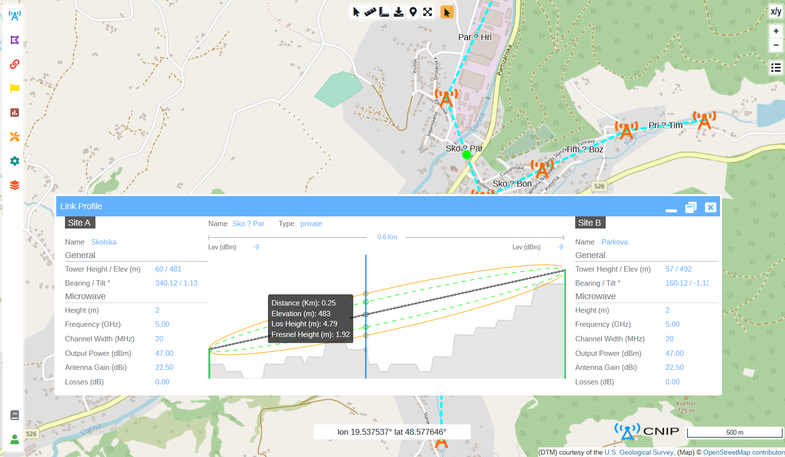](https://youtu.be/YhsLJE-dtFQ)

#### Finding Best Candidate

- **Best Candidate** analysis to find best site from coverage perspective for given polygon area from specified candidates  based on **Received Power** by analyzing polygon area covered by each power level distribution for each candidate

Click below picture to watch video
[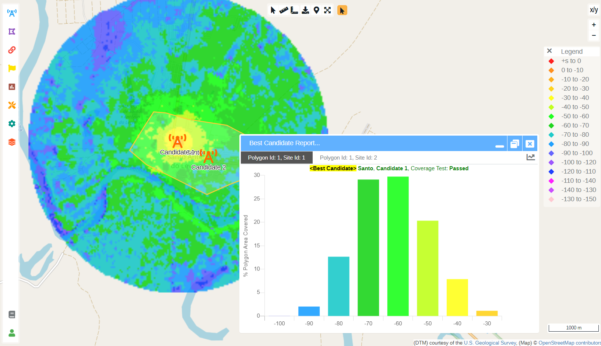](https://youtu.be/YEHYiHYV8UM)

#### Auto Predicting Sites

- **Predict Sites** analysis for automatic site placement to cover the given polygon area using [k-means clustering ML](https://en.wikipedia.org/wiki/K-means_clustering)
- Automatic **Antenna Height** prediction by elevating site antenna above average terrain and clutter heights within the cell radius to meet line of sight
- Automatic **RF Power** calculation based on cell radius

Click below picture to watch video
[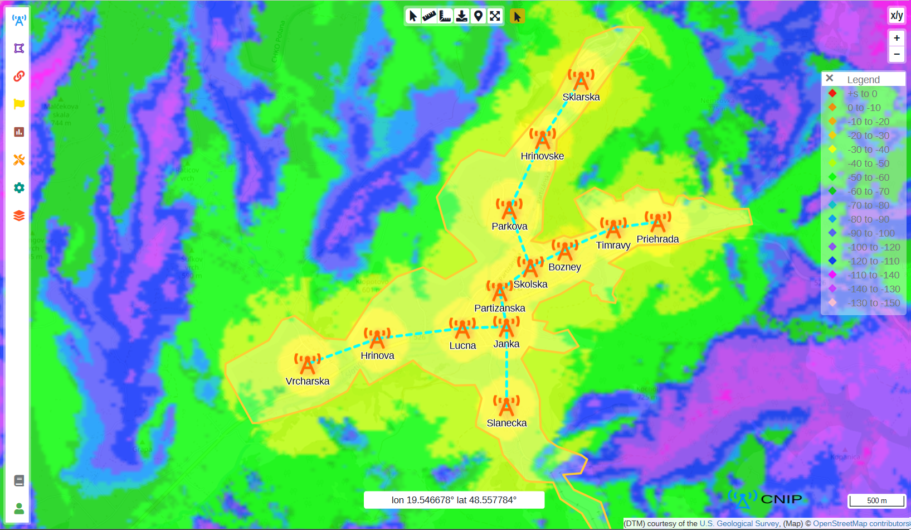](https://youtu.be/XQO9PPEfgMs)

#### Choosing Background Map

- Tile Maps: [OpenStreetMap](https://openstreetmap.org), [OpenTopoMap](https://opentopomap.org), [stamen](http://maps.stamen.com) (Toner, Terrain & Watercolor layers) and [Thunderforest](https://thunderforest.com) (Transport, Cycle, Landscape & Outdoor layers)

Click below picture to watch video
[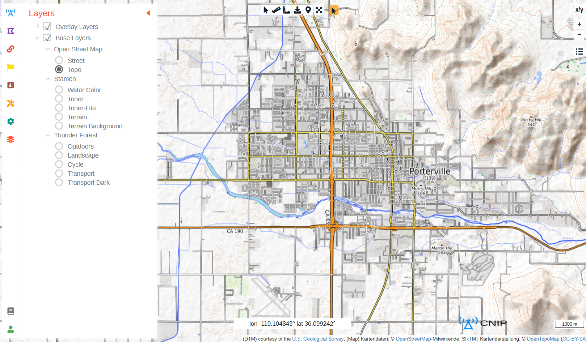](https://youtu.be/KqrDkBjwYeY)

#### Adding User Notes

Click below picture to watch video
[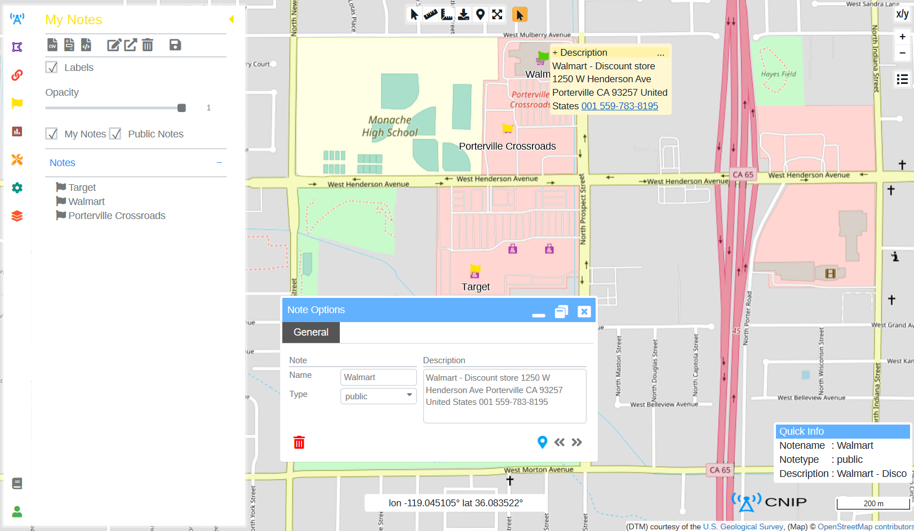](https://youtu.be/Xvp_PghEiOU)

#### Loading Sites From GeoJSON File

- Site database in the below GeoJSON format supported
- Use [MyGeodata Converter](https://mygeodata.cloud/converter) to convert your DATA to GeoJSON format

Click below picture to watch video
[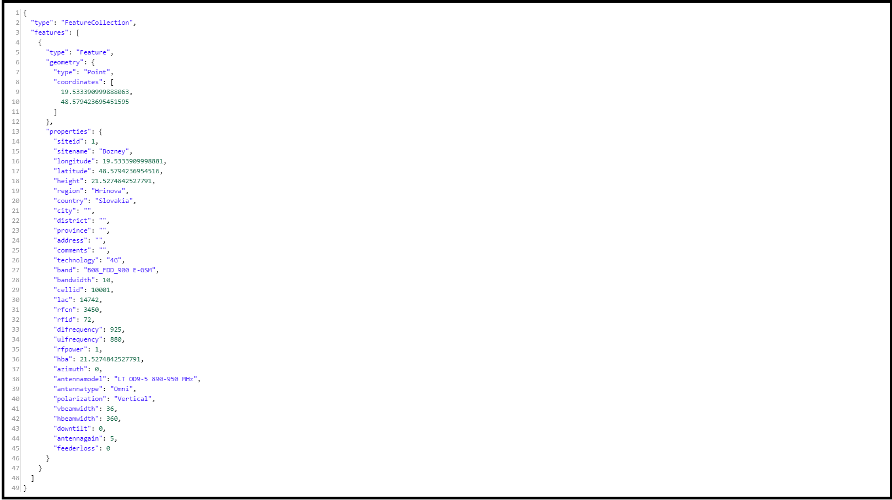](https://youtu.be/ge0gKfsEUG8)

#### Loading Polygons From GeoJSON File

- Polygons in the below GeoJSON format supported
- Use [MyGeodata Converter](https://mygeodata.cloud/converter) to convert your DATA to GeoJSON format

Click below picture to watch video
[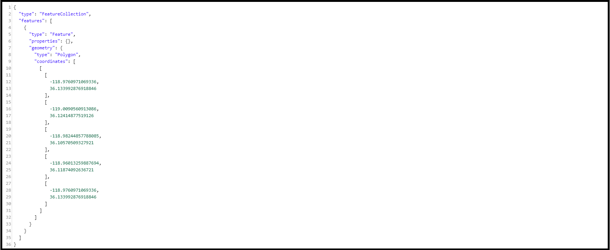](https://youtu.be/j9LWylzOumQ)

## Credits

This software is built on [Visual Studio Community](https://visualstudio.microsoft.com/vs/community) and uses the following open source packages:

##### Digital terrain model
- [U.S. Geological Survey](https://usgs.gov)

#####  RF Signal Propagation
- [SPLAT for Windows](http://ve3ncq.ca/wordpress/?page_id=62)

#####  Database
- [PostgreSQL](https://postgresql.org)

#####  GIS Packages
- [PostGIS](https://postgis.net)
- [pgRouting](https://pgrouting.org)- [Npgsql](https://npgsql.org)
- [GDAL, Repack](https://nuget.org/profiles/maeneak)
- [NTS Topology Suite](https://nettopologysuite.github.io)

#####  Two Factor Authentication
- [GoogleAuthenticator](https://github.com/BrandonPotter/GoogleAuthenticator)
- [QRCoder](https://github.com/codebude/QRCoder)

#####  Web GIS Packages
- [OpenLayers](https://openlayers.org)
- [Turfjs, TURF](https://turfjs.org)

#####  Web GUI Packages
- [ol-ext](https://viglino.github.io/ol-ext)
- [ol-layerswitcher](https://github.com/walkermatt/ol-layerswitcher)
- [sidebar-v2](https://github.com/Turbo87/sidebar-v2)
- [Font Awesome](https://fontawesome.com)
- [noUiSlider](https://refreshless.com/nouislider)
- [Chart.js](https://chartjs.org)
- [PapaParse](https://github.com/mholt/PapaParse)
- [FileSaver.js](https://github.com/eligrey/FileSaver.js)
- [DOM to Image](https://github.com/tsayen/dom-to-image)
- [html2canvas](https://html2canvas.hertzen.com)
- [sorttable](https://kryogenix.org/code/browser/sorttable)
- [table2CSV](https://github.com/rubo77/table2CSV)
- [Bootstrap](https://getbootstrap.com)
- [JQuery](https://jquery.org)
- [Modernizr](https://modernizr.com)
- [Polyfill.io](https://polyfill.io/v3)

#####  Tile Maps
- [OpenStreetMap](https://openstreetmap.org)
- [OpenTopoMap](https://opentopomap.org)
- [stamen](http://maps.stamen.com)
- [Thunderforest](https://thunderforest.com)

##### Algorithms
- [PCI and Frequency planning by Salman Bakhtiyar](https://linkedin.com/in/salman-bakhtiyar-3b18012)
- [Kruskals-minimum-spanning-tree from GeeksforGeeks](https://www.geeksforgeeks.org/kruskals-minimum-spanning-tree-algorithm-greedy-algo-2)
- [Geo-distance from C# Corner by Alex Bell](https://www.c-sharpcorner.com/blogs/the-orthodromic-distance-between-two-geopoints1)

#####  Readme
- [M Editor.md](https://pandao.github.io/editor.md/en.html)

## License

This software code is licensed under the BSD license, located in OpenCellular [LICENSE-SOFTWARE](https://github.com/Telecominfraproject/OpenCellular/blob/master/LICENSE-SOFTWARE) branch

## Links

- [Website](http://18.220.148.72/cnip)
- [Source code](https://github.com/Telecominfraproject/OpenCellular/tree/cnip/software/cnip)
- [Discussion and Issues](https://github.com/alirazaanis/Community-Network-Interactive-Planner/issues)